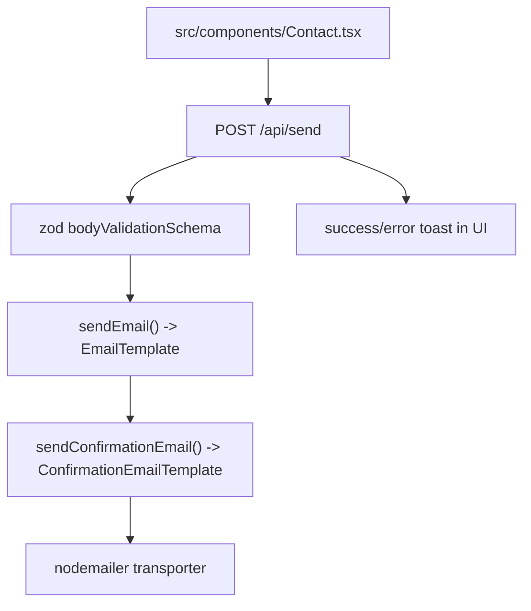

# Contact Pipeline

The contact flow starts in `src/components/Contact.tsx` (uncontrolled form + consent checkbox), posts `{name,email,message}` JSON to `POST /api/send`, validates input with Zod in `src/app/api/send/route.tsx`, sends an owner notification via `EmailTemplate`, and then best-effort sends a bilingual confirmation via `ConfirmationEmailTemplate` using a shared Nodemailer transporter in `src/app/helper/email.tsx`.

Related
- [../summary.md](../summary.md)
- [../terminology.md](../terminology.md)
- [../practices.md](../practices.md)
- [../i18n/copy-editing.md](../i18n/copy-editing.md)



```tsx
const payload = {
  name: String(formData.get("name")),
  email: String(formData.get("email")),
  message: String(formData.get("message")),
};

await fetch("/api/send", {
  method: "POST",
  headers: { "Content-Type": "application/json" },
  body: JSON.stringify(payload),
});
```

Invariants
- API payload contract is fixed to `name`, `email`, and `message`.
- Invalid payloads return `400`; owner email failure returns `500`; confirmation email failure is logged and does not fail the API response.
- UI success/error states are surfaced via `sonner` toasts from the client component.
- Email templates remain server-only rendering artifacts under `src/app/components/`.

Contracts
- `sendEmail({name,email,message})` must send to `EMAIL_TO` using SMTP credentials from environment variables.
- `sendConfirmationEmail({name,email})` sends to the submitter address and uses an absolute logo URL derived from `NEXT_PUBLIC_SITE_URL`.
- Contact inputs require `name` attributes because `FormData` serialization ignores fields without `name`.
- Consent checkbox is required client-side before submit can complete.

Rationale
- Separate owner and confirmation templates keep internal triage concise while giving users immediate receipt confirmation.

Lessons learned
- Treat confirmation delivery as non-blocking to avoid dropping valid inquiries when only the second email path fails.
- React Email templates render more reliably when using email primitives (`Section`, `Container`, `Text`, `Img`) and absolute asset URLs.
