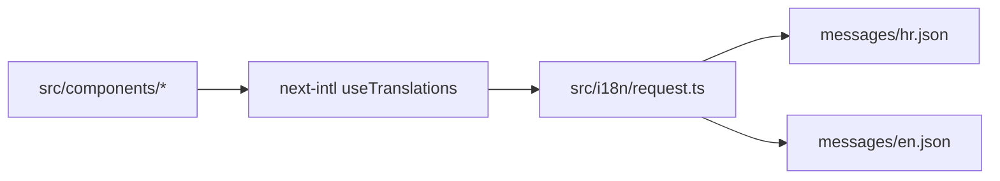

# Copy Editing

Website copy is managed in locale message catalogs under `messages/hr.json` and `messages/en.json`; both files must keep the same translation key structure so UI components can resolve the same key in both locales, and routine copy work is value-only editing (do not rename or remove keys).

Related
- [summary.md](summary.md)
- [../practices.md](../practices.md)
- [../terminology.md](../terminology.md)



```json
{
  "hero": {
    "title": "Pouzdana pravna pomoć za građane i tvrtke"
  }
}
```

```json
{
  "hero": {
    "title": "Reliable legal assistance for individuals and companies"
  }
}
```

Invariants
- `messages/hr.json` and `messages/en.json` use matching nested keys.
- Default locale content comes from `messages/hr.json` at unprefixed routes.
- English content comes from `messages/en.json` at `/en/*` routes.
- Standard copy updates change only string values while preserving keys and nesting.

Contracts
- Components call `useTranslations(namespace)` and expect keys to exist in both locale files.
- `src/i18n/request.ts` loads locale JSON dynamically from `messages/${locale}.json`.
- Changing copy does not require code changes when the key path is unchanged.

Rationale
- Keeping translation files symmetric prevents runtime missing-key issues and makes copy updates safe for non-code edits.

Lessons learned
- Prefer small wording changes on existing keys over adding new keys unless component behavior changes.
- Validate both `/` and `/en` after editing copy to catch locale mismatches early.
- If a key must change, update all locale files and every component lookup in the same change.
