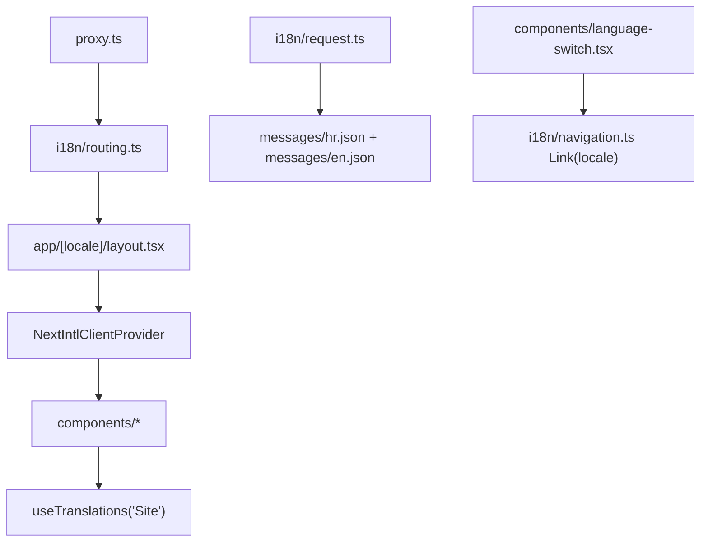

# Internationalization

The app uses `next-intl` with locale-aware routing and message-file translations: locale behavior is defined in `i18n/routing.ts`, request-time message loading in `i18n/request.ts`, middleware/proxy matching in `proxy.ts`, and translated copy in `messages/hr.json` + `messages/en.json` under the shared `Site` namespace.

Related
- [../summary.md](../summary.md)
- [../terminology.md](../terminology.md)
- [../practices.md](../practices.md)



```ts
export const routing = defineRouting({
  locales: ["hr", "en"],
  defaultLocale: "hr",
  localePrefix: "as-needed",
  localeDetection: false
});

const t = useTranslations("Site");
t("nav.about");
```

Invariants
- Locales are limited to `hr` and `en`.
- Default locale is `hr` and remains unprefixed (`localePrefix: "as-needed"`).
- Localized pages are served from `app/[locale]/...`.
- Components resolve text via `useTranslations("Site")` from message files.

Contracts
- `proxy.ts` must use the shared `routing` object for locale matching.
- `app/[locale]/layout.tsx` validates locale and mounts `NextIntlClientProvider`.
- `components/language-switch.tsx` uses localized navigation links to switch locale.
