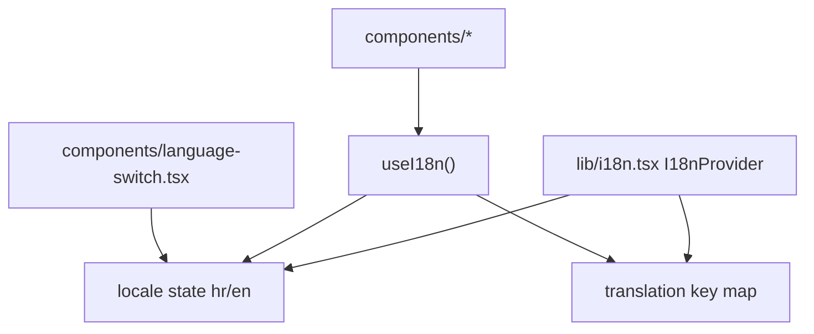

# Internationalization

The app uses a custom client-side i18n context in `lib/i18n.tsx` with two locales (`hr`, `en`); all translatable strings are stored in a single in-memory translation object and components resolve text through `useI18n().t(key)`, while language selection updates context state via `setLocale`.

Related
- [../summary.md](../summary.md)
- [../terminology.md](../terminology.md)
- [../practices.md](../practices.md)



```tsx
const [locale, setLocale] = useState<Locale>("hr");

const translate = useCallback((key: string) => {
  const entry = t[key];
  if (!entry) return key;
  return entry[locale];
}, [locale]);
```

Invariants
- Default locale initializes to `hr`.
- Locale state is client-side and applies immediately without route changes.
- Components must call `useI18n()` only under `I18nProvider`.
- Missing translation keys fall back to the key string itself.

Contracts
- `app/page.tsx` wraps all sections with `I18nProvider`.
- `components/language-switch.tsx` is the canonical locale switch control.
- `lib/i18n.tsx` is the single source of translatable copy keys.
