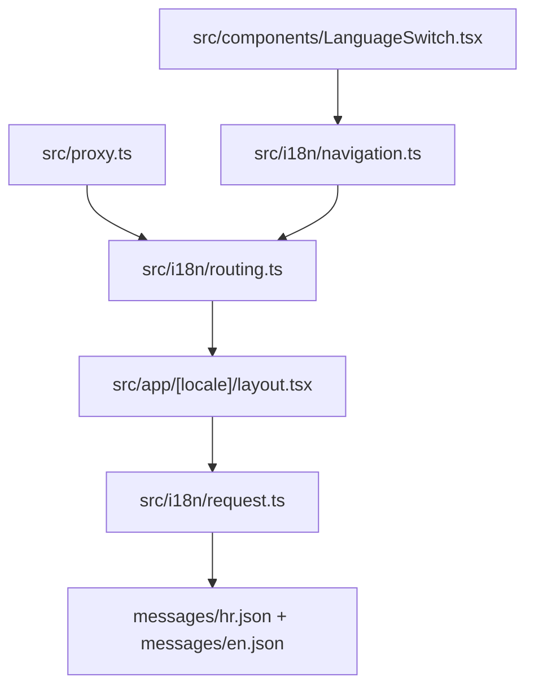

# Internationalization

The app uses `next-intl` with `localePrefix: "as-needed"`, so Croatian (`hr`) is the default locale at unprefixed URLs (for example `/`) while English uses an explicit `/en` prefix; locale routing is applied through `src/proxy.ts`, request-time message loading is handled by `src/i18n/request.ts`, and language switching is provided by `src/components/LanguageSwitch.tsx` via helpers from `src/i18n/navigation.ts`.

Related
- [../summary.md](../summary.md)
- [../terminology.md](../terminology.md)
- [../practices.md](../practices.md)
- [copy-editing.md](copy-editing.md)



```ts
export const routing = defineRouting({
  locales: ["hr", "en"],
  defaultLocale: "hr",
  localePrefix: "as-needed",
  localeDetection: false
});
```

Invariants
- Default locale is `hr`.
- Default locale (`hr`) stays unprefixed in URLs.
- App routes are served through `src/app/[locale]/` for localized pages.
- Translation keys in `messages/hr.json` and `messages/en.json` stay aligned.

Contracts
- `src/proxy.ts` applies `next-intl` routing using the shared `routing` config.
- `src/i18n/request.ts` resolves a valid locale and loads matching messages.
- Locale switch UI uses localized navigation helpers from `src/i18n/navigation.ts`.
