# Lode Map

Index of project knowledge.

Core
- [Summary](summary.md)
- [Terminology](terminology.md)
- [Practices](practices.md)

UI
- [UI Summary](ui/summary.md)
- [Home Main Content](ui/home-main-content.md)
- [Header Layout](ui/header-layout.md)
- [Footer Layout](ui/footer-layout.md)
- [Brand Logo](ui/brand-logo.md)
- [Map Section](ui/map-section.md)
- [Language Support](ui/language-support.md)
- [Highlight Banner](ui/highlight-banner.md)

Plans
- [Current Plan](plans/current-plan.md)

Scratch
- `tmp/` (session scraps, git-ignored)

```mermaid
graph TD
  LodeMap["lode-map.md"] --> Summary["summary.md"]
  LodeMap --> Terminology["terminology.md"]
  LodeMap --> Practices["practices.md"]
  LodeMap --> UiSummary["ui/summary.md"]
  LodeMap --> UiHomeMain["ui/home-main-content.md"]
  LodeMap --> UiHeader["ui/header-layout.md"]
  LodeMap --> UiFooter["ui/footer-layout.md"]
  LodeMap --> UiBrandLogo["ui/brand-logo.md"]
  LodeMap --> UiMap["ui/map-section.md"]
  LodeMap --> UiLanguage["ui/language-support.md"]
  LodeMap --> UiBanner["ui/highlight-banner.md"]
  LodeMap --> Plans["plans/current-plan.md"]
  LodeMap --> Tmp["tmp/"]
```



```bash
ls lode
```

Invariants
- Each Lode file covers one topic, stays under 250 lines, and includes a code example and Mermaid diagram.
- Lode entries link to related Lode files using relative paths.
- UI behavior and structure are documented under `lode/ui/`.
