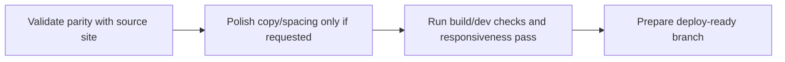

# Current Plan

Short-term plan for stabilizing and refining the imported Website Pavic implementation.

Related
- [Summary](../summary.md)
- [Terminology](../terminology.md)
- [Practices](../practices.md)



```tsx
export default function Home() {
  return (
    <main>
      <section id="hero" />
      <section id="banner" />
      <section id="about" />
      <section id="services" />
      <section id="contact" />
    </main>
  );
}
```

Plan
1. Verify imported app matches source visuals and section order exactly.
2. Keep dependency/tooling parity (`pnpm-lock.yaml`, Next/Tailwind config alignment).
3. Run build and runtime smoke checks for independent operation in this repo.
4. Address only critical regressions (broken imports, missing assets, config mismatches).
5. Defer design/content changes until explicitly requested.

Invariants
- `app/page.tsx` remains the main entry route.
- The section composition order stays `Hero -> Banner -> About -> Services -> Contact`.
