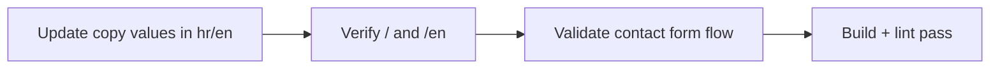

# Current Plan

Short-term operating plan for maintaining content quality, translation consistency, and contact form reliability.

Related
- [Summary](../summary.md)
- [Terminology](../terminology.md)
- [Practices](../practices.md)



```tsx
async function saveCopy() {
  // Values may change, key paths stay stable across locales.
}
```

Plan
1. Keep `messages/hr.json` and `messages/en.json` key structure aligned.
2. Treat copy updates as value-only changes unless component requirements change.
3. Verify locale rendering at `/` and `/en` for each content update.
4. Keep contact form operational by validating `.env` SMTP values in each environment.
5. Run lint and production build before shipping substantial updates.

Invariants
- Localized routes continue to be served through `src/app/[locale]/`.
- Contact form posting contract (`name`, `email`, `message`) stays stable for `/api/send`.
