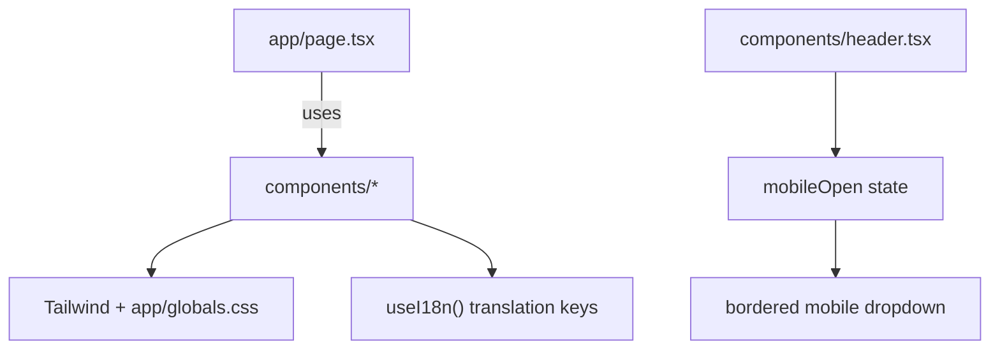

# Practices

Patterns and conventions used in this repository.

Related
- [Summary](summary.md)
- [Terminology](terminology.md)
- [Current Plan](plans/current-plan.md)
- [Internationalization](i18n/summary.md)



```tsx
{mobileOpen && (
  <nav className="flex flex-col gap-4 border-t border-brand-200/60 bg-white px-6 py-6 md:hidden">
    <a href="#about">{t("nav.about")}</a>
    <a href="#services">{t("nav.services")}</a>
    <a href="#contact">{t("nav.contact")}</a>
  </nav>
)}
```

Practices
- Keep global HTML/body concerns in `app/layout.tsx`; compose visible page sections in `app/page.tsx`.
- Prefer Tailwind utility classes plus tokenized colors (`brand-*`, `ink-*`) from `tailwind.config.ts`.
- Keep section content in focused components (`components/hero.tsx`, `components/about.tsx`, `components/services.tsx`, `components/contact.tsx`).
- Use `useI18n()` in UI components and store translation keys centrally in `lib/i18n.tsx`.
- Keep header fixed with desktop links on `md+` and a stateful mobile dropdown on smaller breakpoints.

Lessons
- Clear section decomposition keeps visual iteration fast while preserving a consistent brand tone.
- Local i18n context is sufficient for a single-route marketing site and avoids router-level localization complexity.
