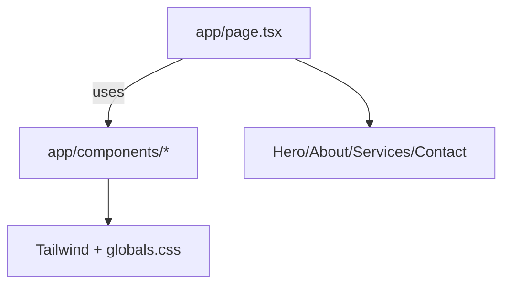

# Practices

Patterns and conventions used in this repository.

Related
- [Summary](summary.md)
- [Terminology](terminology.md)
- [Current Plan](plans/current-plan.md)
- [Home Main Content](ui/home-main-content.md)
- [Header Layout](ui/header-layout.md)



```tsx
const Button = ({ disabled = false, onClick, text }: ButtonProps) => (
  <button
    className="bg-yellow-400 py-2 px-5 text-black rounded-2xl"
    disabled={disabled}
    onClick={onClick}
  >
    {text}
  </button>
);
```

Practices
- Keep global layout concerns in `app/layout.tsx`.
- Prefer Tailwind utilities for component styling; use `app/globals.css` for globals.
- Define shared palette tokens in `app/globals.css` (`--accent`, `--text`, `--background`, `--surface`, `--border`) and consume them via utility classes.
- Keep copy in `app/lib/translations.ts` and read it via `LanguageProvider` instead of hardcoding strings in sections.
- Place reusable UI in `app/components/`.
- Keep landing-page body content in `app/page.tsx` unless sections become reusable.
- Keep header sticky with a subtle surface and left/right split: `BrandLogo` on the left, `About Us` + `Services` + contact CTA on the right.
- Place language switcher controls (`HR | EN`) at the far right of header actions, with active-state emphasis and `aria-pressed`.
- In hero, use a responsive two-column split from tablet upward so primary CTA sits to the right.
- Reuse `BrandLogo` in both header and footer to keep top-link behavior consistent.
- Keep footer contact details as three labeled segments (Email, Phone, Location) arranged horizontally with wrapping, and keep `mailto:`/`tel:` links clickable.
- Use responsive service grids for six-card sections: `grid-cols-1 md:grid-cols-2 lg:grid-cols-3`.
- Keep map/location placeholder section directly after services and before contact.
- Implement about-section desktop split with mobile stacking (`lg:grid-cols-*` then single-column default).
- When section markup grows, extract route-scoped components under `app/components/home/` and keep `app/page.tsx` as a composition layer.
- Avoid decorative underline/divider elements directly under headings; rely on typography and spacing for section hierarchy.
- Reuse a dedicated CTA anchor component (`CtaButton`) instead of duplicating styled anchor markup.
- Apply shared `.btn-primary` styling for CTA-level buttons to maintain contrast on both light and dark surfaces.
- Persist language selection using `site_lang` in localStorage and default to Croatian.

Lessons
- Minimal scaffolding is easier to evolve than over-structured pages.

Invariants
- Header and footer are controlled by layout and should not be edited when implementing page body sections.

Contracts
- Hero CTA must target an existing `#contact` section ID on the same page.

Rationale
- Predictable section rhythm and responsive breakpoints improve readability for professional services pages.
