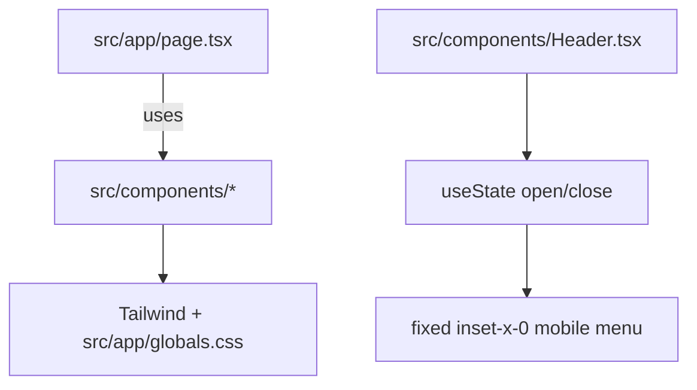

# Practices

Patterns and conventions used in this repository.

Related
- [Summary](summary.md)
- [Terminology](terminology.md)
- [Current Plan](plans/current-plan.md)
- [Internationalization](i18n/summary.md)



```tsx
{isOpen && (
  <nav className="fixed inset-x-0 z-50 flex w-screen flex-col items-start bg-black px-7 py-4">
    <Navigation orijentation="col" />
  </nav>
)}
```

Practices
- Keep global layout concerns in `src/app/layout.tsx`.
- Prefer Tailwind utilities for component styling; use `src/app/globals.css` for globals.
- Place reusable UI in `src/components/`.
- Keep the hero section in `src/components/Hero.tsx` on a solid dark brand background (`bg-brand-900`) with high-contrast white foreground text.
- Keep the hero photo treatment minimal: image + gradient overlays only, without bottom-left identity badges or name chips.
- In `src/components/About.tsx`, render the portrait with `next/image` using `/ivan-pavic-photo.jpg` from `public/` and remove placeholder-only layers once a real photo exists.
- Keep the About name badge in `src/components/About.tsx` on a near-white translucent background (`bg-white/70`) with dark text (`text-ink-900`, `text-ink-700`) so it stays readable over dark photo areas.
- Keep mobile menu links hidden by default and reveal them only when the header toggle state is open.
- Render the opened mobile menu as a full-width overlay (`fixed inset-x-0 w-screen`) below the header.
- For uncontrolled forms, use `name` attributes on inputs when reading values with `FormData`; `id` alone is not serialized.
- In React form handlers, derive submit event type from `ComponentProps<"form">["onSubmit"]` to match JSX expectations exactly and avoid relying on potentially deprecated global aliases.

Lessons
- Minimal scaffolding is easier to evolve than over-structured pages.
- Locale routing is cleaner when default locale is unprefixed and only alternate locales are prefixed.
