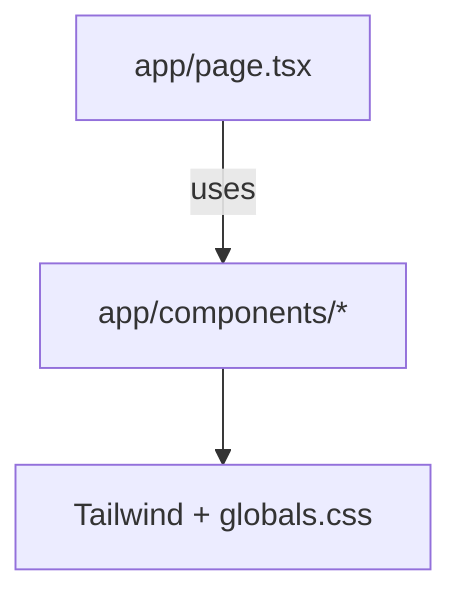

# Practices

Patterns and conventions used in this repository.

Related
- [Summary](summary.md)
- [Terminology](terminology.md)
- [Current Plan](plans/current-plan.md)



```tsx
const Button = ({ disabled = false, onClick, text }: ButtonProps) => (
  <button
    className="bg-yellow-400 py-2 px-5 text-black rounded-2xl"
    disabled={disabled}
    onClick={onClick}
  >
    {text}
  </button>
);
```

Practices
- Keep global layout concerns in `app/layout.tsx`.
- Prefer Tailwind utilities for component styling; use `app/globals.css` for globals.
- Place reusable UI in `app/components/`.

Lessons
- Minimal scaffolding is easier to evolve than over-structured pages.
