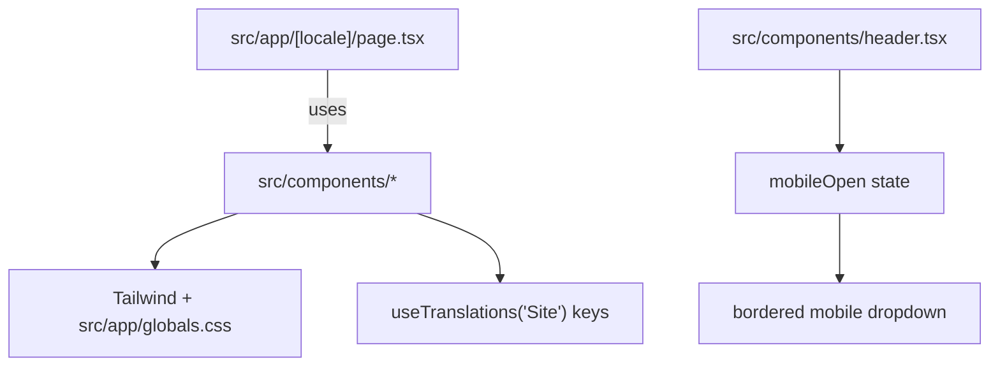

# Practices

Patterns and conventions used in this repository.

Related
- [Summary](summary.md)
- [Terminology](terminology.md)
- [Current Plan](plans/current-plan.md)
- [Internationalization](i18n/summary.md)



```tsx
{mobileOpen && (
  <nav className="flex flex-col gap-4 border-t border-brand-200/60 bg-white px-6 py-6 md:hidden">
    <a href="#about">{t("nav.about")}</a>
    <a href="#services">{t("nav.services")}</a>
    <a href="#contact">{t("nav.contact")}</a>
  </nav>
)}
```

Practices
- Keep global HTML/body concerns in `src/app/layout.tsx`; compose visible page sections in `src/app/[locale]/page.tsx`.
- Prefer Tailwind utility classes plus tokenized colors (`brand-*`, `ink-*`) from `tailwind.config.ts`.
- Keep section content in focused components (`src/components/hero.tsx`, `src/components/about.tsx`, `src/components/services.tsx`, `src/components/contact.tsx`).
- Use `useTranslations("Site")` in UI components and store translation keys in `messages/hr.json` and `messages/en.json` loaded through `src/i18n/request.ts`.
- Keep header fixed with desktop links on `md+` and a stateful mobile dropdown on smaller breakpoints.
- Header contact CTA in `src/components/header.tsx` uses inverted brand contrast (`bg-brand-900` + `text-brand-50`) on both desktop and mobile states.
- Language switch control in `src/components/language-switch.tsx` uses `border-brand-900`; the active locale pill uses `bg-[#d3dce0]` to match the header background, while inactive locale pills use `bg-white`.
- Brand logo asset is stored at `public/images/logo.png` and reused in both `src/components/header.tsx` and `src/components/footer.tsx` via `next/image`.
- Header and footer brand lockups (logo + adjacent name text) are clickable anchors to `#top`; `app/[locale]/page.tsx` provides the `id="top"` target.
- In both header and footer lockups, subtitle text (`header.subtitle`) is displayed above the person name (`Ivan Pavić`).
- Header and footer logo lockup visual scale is increased by ~30% (logo dimensions and adjacent subtitle/name typography).
- Footer lockup name in `src/components/footer.tsx` uses the same sans-serif style as the header lockup name (no serif override).
- Footer brand column does not render an additional subtitle/name text block below the clickable logo lockup.
- Footer logo in `src/components/footer.tsx` renders without brightness/invert/opacity filters so the source PNG colors are preserved.
- Footer privacy link in `src/components/footer.tsx` uses localized `Link` from `src/i18n/navigation.ts` to keep locale context when opening `/privacy-policy`.
- Header shell in `src/components/header.tsx` separates structure into a solid `#d3dce0` content bar plus a distinct vertical gradient strip (`h-[11px]`, `bg-gradient-to-b from-black/25 to-transparent`) so the fade ends in true transparency over page content.
- Primary section titles in `src/components/hero.tsx`, `src/components/about.tsx`, `src/components/services.tsx`, and `src/components/contact.tsx` use slight letter-spacing (`tracking-[0.01em]`) to improve readability and prevent visual character crowding.
- Hero section in `src/components/hero.tsx` is text-first with no image panel; content is centered (`items-center`, `text-center`) with centered badges and CTAs.
- Hero subtitle copy uses a manual line break from translation strings (`\n` in `messages/*.json`) and renders with `whitespace-pre-line` in `src/components/hero.tsx`.
- Identity badge card (IP avatar + name/role) is anchored on the about photo in `src/components/about.tsx` at the bottom-right overlay position; the hero image in `src/components/hero.tsx` no longer renders this floating card.
- Contact section container in `src/components/contact.tsx` uses a white background (`bg-white`) behind the form and info columns.
- Contact address card in `src/components/contact.tsx` is a clickable external link to `https://maps.app.goo.gl/hzKKXtUko1y1MPVo7` and opens in a new tab.
- Footer address in `src/components/footer.tsx` links to the same external map URL (`https://maps.app.goo.gl/hzKKXtUko1y1MPVo7`) and opens in a new tab.
- Contact and footer communication links use app-deep links (`mailto:` for email, `tel:` for phone) so clicks open the default email/phone app; only HTTP map links open in a new tab.
- Footer contact links in `src/components/footer.tsx` include leading Lucide icons (`Mail`, `Phone`, `MapPin`) aligned inline with each contact value.
- Footer working-hours row in `src/components/footer.tsx` includes a leading Lucide `Clock3` icon before the hours value (not in the heading).
- Contact info cards (email/phone/address) in `src/components/contact.tsx` use `w-full` so all three cards have equal width.
- Service cards in `src/components/services.tsx` are informational only and do not include per-card CTA labels.
- Service cards in `src/components/services.tsx` render icon and title on the same row; the decorative accent line keeps a constant gray base (`bg-brand-200`) and on hover reveals a left-to-right blue overlay (`bg-brand-800`) matching the icon highlight tone.
- Services grid uses a uniform 3-column desktop layout; labor law renders as a standard card alongside enforcement law in the same row.
- Property and land registry service card in `src/components/services.tsx` uses the `House` icon from `lucide-react`.
- Labor law service card in `src/components/services.tsx` uses the `Wrench` icon from `lucide-react`.
- Third About bullet row (`about.bullet3`) in `src/components/about.tsx` uses the `Handshake` icon from `lucide-react`.
- About-section bullet rows in `src/components/about.tsx` use `items-center` so icon badges and adjacent text align on the same vertical center line.
- About content in `src/components/about.tsx` uses natural responsive wrapping (no forced equal-width or nowrap text-length constraints across lead, bullets, focus, and animated value pill).
- About focus callout in `src/components/about.tsx` renders a `focusLabel` heading above the body text; the body copy omits a duplicated `Focus:` prefix.
- About section value highlights in `src/components/about.tsx` render as one animated pill that auto-rotates between the three value statements every ~3.6s and displays title above description (no trailing colon).
- About animated value pill in `src/components/about.tsx` spans full column width and keeps the standard left-aligned icon/text layout.
- About photo column in `src/components/about.tsx` uses a desktop negative top offset (`lg:-mt-24`) so the portrait starts at approximately the same vertical level as the section title.

Lessons
- Clear section decomposition keeps visual iteration fast while preserving a consistent brand tone.
- Local i18n context is sufficient for a single-route marketing site and avoids router-level localization complexity.
