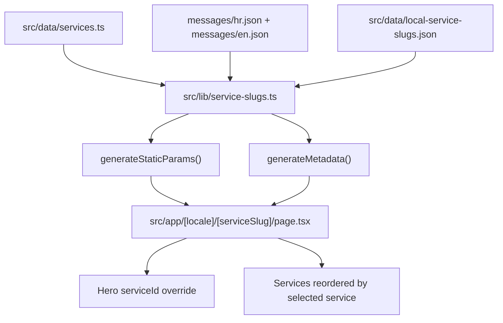

# Services

Service landing pages are locale-aware static routes generated from `src/lib/service-slugs.ts`: each locale gets base slugs derived from translated service titles (`messages/*.json`) and Croatian additionally gets city-keyword SEO slugs from `src/data/local-service-slugs.json`, all rendered through `src/app/[locale]/[serviceSlug]/page.tsx` with slug-specific metadata from `generateMetadata`.

Related
- [../summary.md](../summary.md)
- [../terminology.md](../terminology.md)
- [../practices.md](../practices.md)
- [../i18n/summary.md](../i18n/summary.md)



```ts
export const dynamicParams = false;

export async function generateStaticParams() {
  return routing.locales.flatMap((locale) =>
    getServiceSlugs(locale).map((serviceSlug) => ({ locale, serviceSlug })),
  );
}
```

Invariants
- `src/app/[locale]/[serviceSlug]/page.tsx` is statically generated from the slug library and rejects unknown slugs with `notFound()`.
- `serviceId` controls hero title/description overrides and services card ordering when a slug maps to a known service.
- Slug collisions are removed by first-seen deduplication in `getServiceSlugEntries`.
- Local SEO slugs currently exist only for `hr`; `en` local slug config is empty.

Contracts
- `getServiceSlugEntry(locale, slug)` returns either a full slug entry or `null`; callers must handle `null` explicitly.
- `slugForService(messages, serviceId)` always returns a non-empty slug by falling back to `slugify(serviceId)` if translation title is missing.
- `LanguageSwitch` translates single-segment service paths by resolving target locale slug from shared `serviceId`.
- `src/app/sitemap.ts` consumes `getServiceSlugEntries` to publish service URLs and hreflang alternates.

Rationale
- Keep one reusable page layout while enabling SEO-focused entry points for practice-area and city-intent queries.

Lessons learned
- Mapping cross-locale routes by semantic id (`serviceId`) is more robust than trying to translate URL text directly.
- Putting local slug templates in JSON keeps SEO copy iteration out of route logic.
