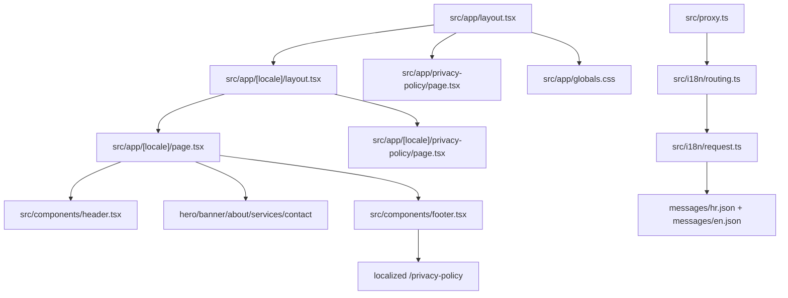

# Summary

Website Pavic is a Next.js 16 App Router marketing site for a law office with locale-aware routing (`hr`, `en`) via `next-intl`; the homepage sections (hero, banner, about, services, contact) and privacy policy are served under `src/app/[locale]/`, while shared UI lives in `src/components/` and styling uses Tailwind with the brand/ink palette.

Related
- [Terminology](terminology.md)
- [Practices](practices.md)
- [Current Plan](plans/current-plan.md)
- [Internationalization](i18n/summary.md)



```tsx
export default function Page() {
  return (
    <>
      <Header />
      <main>
        <Hero />
        <Banner />
        <About />
        <Services />
        <Contact />
      </main>
      <Footer />
    </>
  );
}
```

```tsx
export default function RootLayout({
  children,
}: {
  children: React.ReactNode;
}) {
  return (
    <html lang="hr" className="scroll-smooth">
      <body className="bg-white text-ink-900 antialiased">
        {children}
      </body>
    </html>
  );
}
```

Invariants
- The app entry route is `src/app/[locale]/page.tsx` and renders the section flow for the homepage.
- A localized static route exists at `src/app/[locale]/privacy-policy/page.tsx` for privacy policy content, with a direct fallback at `src/app/privacy-policy/page.tsx`; copy is sourced from `messages/hr.json` and `messages/en.json` under `Site.privacyPolicy`.
- The root layout in `src/app/layout.tsx` only sets global HTML/body shell and imports `src/app/globals.css`.
- Translations come from `next-intl` message files in `messages/` and are resolved with `useTranslations("Site")`.
- Header navigation targets in-page anchors (`#about`, `#services`, `#contact`) with a mobile toggle menu.
- The main visual system is the `brand-*` and `ink-*` Tailwind palette defined in `tailwind.config.ts`.
- Primary CTA interactions in `src/components/hero.tsx`, `src/components/header.tsx`, and `src/components/contact.tsx` use the app-level `Button` from `src/components/button.tsx`, which wraps the shadcn primitive from `src/components/ui/button.tsx` (including `asChild` anchor links).
- The active app UI primitive set under `src/components/ui/` is intentionally minimal and currently includes `button`, `input`, `label`, `textarea`, and `checkbox`.
- Package management is npm-first with a committed `package-lock.json`; `next.config.mjs` sets `turbopack.root` to `process.cwd()` to keep root detection aligned to this repository.

Rationale
- Locale-aware routing with `next-intl` keeps translation behavior deterministic and aligns with multilingual URL expectations.
