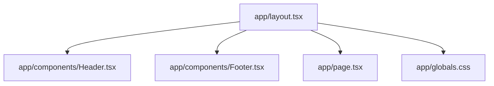

# Summary

Website Pavic is a small Next.js 16 App Router site with a shared layout (header + footer), a minimal home page, and a footer that includes placeholder contact details, styled using Tailwind CSS v4 and a single global stylesheet.

Related
- [Terminology](terminology.md)
- [Practices](practices.md)
- [Current Plan](plans/current-plan.md)



```tsx
export default function RootLayout({ children }: { children: React.ReactNode }) {
  return (
    <html lang="en">
      <body>
        <Header />
        {children}
        <Footer />
      </body>
    </html>
  );
}
```

Invariants
- All pages render inside the shared root layout.
- Styling uses Tailwind utility classes plus `app/globals.css`.
- The home page lives at `app/page.tsx`.

Rationale
- A simple layout keeps the site structure consistent while content evolves.
