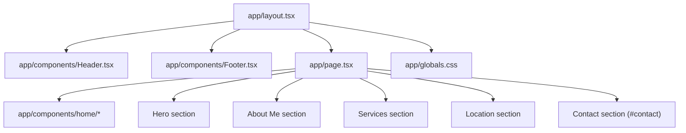

# Summary

Website Pavic is a small Next.js 16 App Router site with a shared layout (header + footer) where a sticky header uses shared `BrandLogo` plus right-side anchor actions (About Us, Services, Contact CTA), the hero places CTA on the right at tablet/desktop widths, services render six cards in a responsive 1/2/3-column grid, and `app/globals.css` defines a project palette around accent `#6c8ca4` with black/neutral base tones.

Related
- [Terminology](terminology.md)
- [Practices](practices.md)
- [Current Plan](plans/current-plan.md)
- [UI Summary](ui/summary.md)



```tsx
export default function RootLayout({ children }: { children: React.ReactNode }) {
  return (
    <html lang="en">
      <body>
        <Header />
        {children}
        <Footer />
      </body>
    </html>
  );
}
```

```tsx
<a href="#contact" className="...">Lorem Ipsum CTA</a>
<section id="contact">...</section>
```

```tsx
<HeroSection />
<AboutSection />
<ServicesSection />
<MapSection />
<ContactSection />
```

Invariants
- All pages render inside the shared root layout.
- Styling uses Tailwind utility classes plus `app/globals.css`.
- The home page lives at `app/page.tsx`.
- Header and footer remain layout-owned and are not modified by home page content work.
- Home section rendering is composed from `app/components/home/` components.

Contracts
- `app/page.tsx` owns only body content between shared layout chrome.
- The primary hero CTA links to `#contact` in the same page.
- Header CTA uses the shared `CtaButton` and defaults to `#contact`.
- Header navigation links target `#about` and `#services`.
- Brand logo defaults to `#top` in both header and footer.
- Palette variables (`--accent`, `--accent-strong`, `--text`, `--background`, `--surface`, `--border`) live in `app/globals.css`.

Rationale
- A simple layout keeps the site structure consistent while content evolves.

Lessons
- A six-card service matrix (`1/2/3` columns) scales better for content growth while preserving mobile readability.
