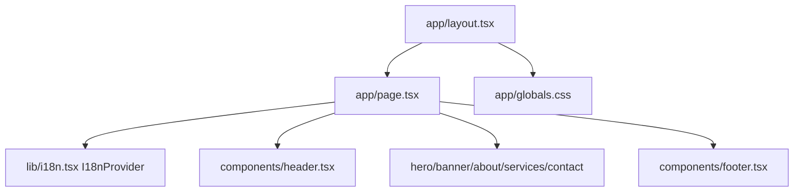

# Summary

Website Pavic is a Next.js 16 App Router single-page marketing site for a law office with sections for hero, banner, about, services, and contact; it uses a custom client-side i18n context (`hr`/`en`), Tailwind CSS with a brand/ink palette, and reusable section components under `components/` rendered from `app/page.tsx`.

Related
- [Terminology](terminology.md)
- [Practices](practices.md)
- [Current Plan](plans/current-plan.md)
- [Internationalization](i18n/summary.md)



```tsx
export default function Page() {
  return (
    <I18nProvider>
      <Header />
      <main>
        <Hero />
        <Banner />
        <About />
        <Services />
        <Contact />
      </main>
      <Footer />
    </I18nProvider>
  );
}
```

```tsx
export default function RootLayout({
  children,
}: {
  children: React.ReactNode;
}) {
  return (
    <html lang="hr" className="scroll-smooth">
      <body className="bg-white text-ink-900 antialiased">
        {children}
      </body>
    </html>
  );
}
```

Invariants
- The app entry route is `app/page.tsx` and renders a one-page section flow.
- The root layout in `app/layout.tsx` only sets global HTML/body shell and imports `app/globals.css`.
- Translations are runtime values from `useI18n()` in `lib/i18n.tsx`, not file-based locale routing.
- Header navigation targets in-page anchors (`#about`, `#services`, `#contact`) with a mobile toggle menu.
- The main visual system is the `brand-*` and `ink-*` Tailwind palette defined in `tailwind.config.ts`.

Rationale
- A section-driven landing page with local i18n keeps copy iteration and visual tuning fast without routing complexity.
