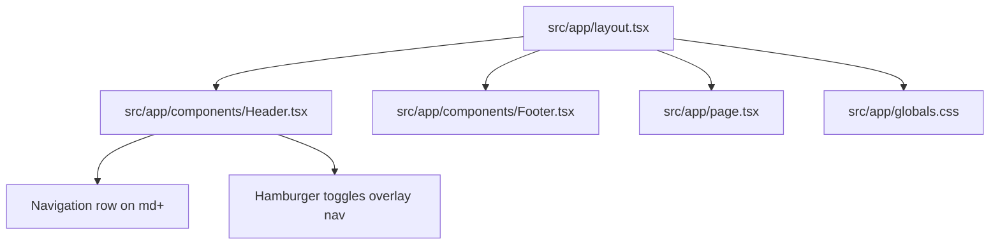

# Summary

Website Pavic is a small Next.js 16 App Router site under `src/app` with a shared root layout (header + footer), a minimal home page, and Tailwind CSS v4 global styles; reusable sections live in `src/components`, and the header contains responsive navigation with a desktop inline menu and a mobile full-width overlay menu that toggles from a hamburger button.

Related
- [Terminology](terminology.md)
- [Practices](practices.md)
- [Current Plan](plans/current-plan.md)
- [Internationalization](i18n/summary.md)



```tsx
export default async function RootLayout({
  children,
  params
}: {
  children: React.ReactNode;
  params: Promise<{locale: string}>;
}) {
  const {locale} = await params;

  return (
    <html lang={locale}>
      <body>
        <NextIntlClientProvider>
          <Header />
          {children}
          <Footer />
        </NextIntlClientProvider>
      </body>
    </html>
  );
}
```

Invariants
- All pages render inside the shared root layout.
- Styling uses Tailwind utility classes plus `src/app/globals.css`.
- The home page lives at `src/app/page.tsx`.
- Mobile navigation links render only after tapping the hamburger icon in `src/app/components/Header.tsx`.
- Open mobile navigation is a full-width overlay dropdown and does not push page content down.

Rationale
- A simple layout keeps the site structure consistent while content evolves.
