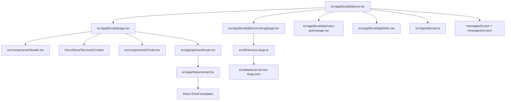

# Summary

Website Pavic is a bilingual Next.js 16 App Router site with Croatian default routes and English `/en` routes, a shared home composition (`Header` + `Hero` + `About` + `Services` + `Contact` + `Footer`), generated service landing pages at `src/app/[locale]/[serviceSlug]/page.tsx`, and a contact pipeline that validates form data in `POST /api/send`, sends an owner email plus a bilingual confirmation email, and exposes localized SEO artifacts through `src/app/sitemap.ts` and `src/app/robots.ts`.

Related
- [Terminology](terminology.md)
- [Practices](practices.md)
- [Current Plan](plans/current-plan.md)
- [Internationalization](i18n/summary.md)
- [Copy Editing](i18n/copy-editing.md)
- [Services](services/summary.md)
- [Contact Pipeline](contact/summary.md)



```tsx
export default function HomePage() {
  return (
    <>
      <Header />
      <main>
        <Hero />
        <About />
        <Services />
        <Contact />
      </main>
      <Footer />
    </>
  );
}
```

Invariants
- All localized pages render under `src/app/[locale]/`.
- Styling uses Tailwind utility classes plus `src/app/[locale]/globals.css`.
- The home page lives at `src/app/[locale]/page.tsx`.
- Service pages are statically generated from locale-aware slug entries and reject unknown slugs via `notFound()`.
- Mobile navigation links render only after tapping the hamburger icon in `src/components/Header.tsx`.
- Hero carousel rotates three assets from `public/`: `sv-duje.png`, `lady-justice.jpg`, and `document-signing.jpg`; users can navigate by click zones, dots, and touch swipes.
- Contact submission contract stays `{ name, email, message }` for the API payload.
- Sitemap entries include hreflang alternates for static routes and service slugs when a locale counterpart exists.

Rationale
- Keep one reusable page composition while enabling localized SEO landing pages and reliable inquiry delivery.
