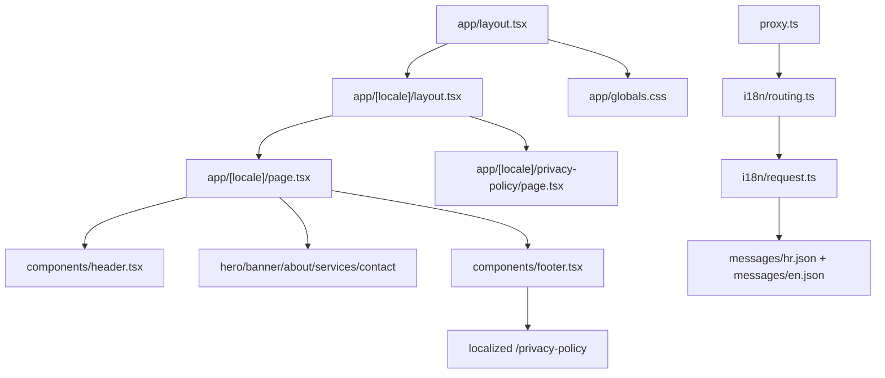

# Summary

Website Pavic is a Next.js 16 App Router marketing site for a law office with locale-aware routing (`hr`, `en`) via `next-intl`; the homepage sections (hero, banner, about, services, contact) and privacy policy are served under `app/[locale]/`, while shared UI lives in `components/` and styling uses Tailwind with the brand/ink palette.

Related
- [Terminology](terminology.md)
- [Practices](practices.md)
- [Current Plan](plans/current-plan.md)
- [Internationalization](i18n/summary.md)



```tsx
export default function Page() {
  return (
    <>
      <Header />
      <main>
        <Hero />
        <Banner />
        <About />
        <Services />
        <Contact />
      </main>
      <Footer />
    </>
  );
}
```

```tsx
export default function RootLayout({
  children,
}: {
  children: React.ReactNode;
}) {
  return (
    <html lang="hr" className="scroll-smooth">
      <body className="bg-white text-ink-900 antialiased">
        {children}
      </body>
    </html>
  );
}
```

Invariants
- The app entry route is `app/[locale]/page.tsx` and renders the section flow for the homepage.
- A localized static route exists at `app/[locale]/privacy-policy/page.tsx` for privacy policy content.
- The root layout in `app/layout.tsx` only sets global HTML/body shell and imports `app/globals.css`.
- Translations come from `next-intl` message files in `messages/` and are resolved with `useTranslations("Site")`.
- Header navigation targets in-page anchors (`#about`, `#services`, `#contact`) with a mobile toggle menu.
- The main visual system is the `brand-*` and `ink-*` Tailwind palette defined in `tailwind.config.ts`.

Rationale
- Locale-aware routing with `next-intl` keeps translation behavior deterministic and aligns with multilingual URL expectations.
