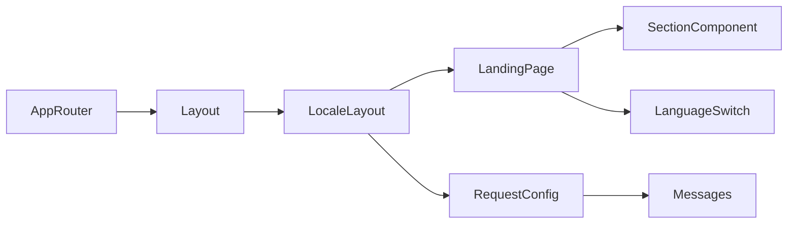

# Terminology

Common project terms and their meaning.

Terms
- App Router - Next.js routing model where routes live in `app/`.
- Root Layout - The shared shell in `app/layout.tsx` that wraps all pages.
- Locale Layout - Route shell in `app/[locale]/layout.tsx` that provides `NextIntlClientProvider`.
- Landing Page - Main localized route in `app/[locale]/page.tsx` that composes all homepage sections.
- Global Styles - Tailwind layers and design tokens in `app/globals.css`.
- Section Component - Reusable block in `components/` (for example `hero.tsx`, `services.tsx`).
- Routing Config - Locale contract in `i18n/routing.ts` (`hr`, `en`, default `hr`, `as-needed` prefix).
- Request Config - Message loader in `i18n/request.ts` that resolves locale and imports `messages/<locale>.json`.
- Language Switch - `components/language-switch.tsx` control that uses localized navigation links with `locale` override.
- Brand/Ink Palette - Tailwind color scale in `tailwind.config.ts` used across buttons, backgrounds, and text.

Related
- [Summary](summary.md)
- [Practices](practices.md)
- [Current Plan](plans/current-plan.md)
- [Internationalization](i18n/summary.md)



```tsx
const t = useTranslations("Site");
const locale = useLocale();

<Link href={pathname} locale="hr">HR</Link>
<Link href={pathname} locale="en">EN</Link>
<span>{t("nav.about")}</span>
```

Contracts
- Components under `components/` are intended for composition from `app/[locale]/page.tsx`.
- `app/layout.tsx` owns document shell concerns; locale-specific providers live in `app/[locale]/layout.tsx`.
