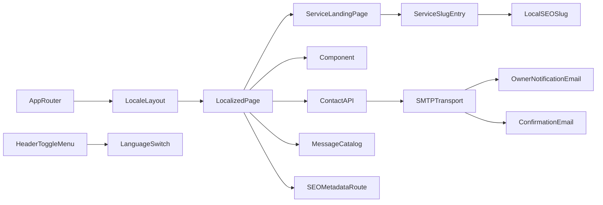

# Terminology

Common project terms and their meaning.

Terms
- App Router - Next.js routing model where pages live in `src/app/`.
- Locale Layout - Per-locale shell in `src/app/[locale]/layout.tsx`.
- Localized Page - Route entry under `src/app/[locale]/`, such as `src/app/[locale]/page.tsx`.
- Service Landing Page - Route entry `src/app/[locale]/[serviceSlug]/page.tsx` generated from locale slug maps.
- Service Slug Entry - Item from `getServiceSlugEntries(locale)` containing slug metadata (`serviceId`, source, optional city SEO fields).
- Local SEO Slug - Additional Croatian city-keyword URL generated from `src/data/local-service-slugs.json`.
- Global Styles - Tailwind base layer and custom CSS in `src/app/[locale]/globals.css`.
- Component - Reusable UI module under `src/components/`.
- Header Toggle Menu - Mobile-only hamburger trigger in `src/components/Header.tsx` that toggles a full-width overlay menu.
- Language Switch - Locale toggle in `src/components/LanguageSwitch.tsx` that links the current pathname to `hr` and `en` using `next-intl` navigation helpers.
- Message Catalog - Locale JSON files `messages/hr.json` and `messages/en.json` that hold website copy.
- Contact API - `POST /api/send` endpoint in `src/app/api/send/route.tsx` that validates request body with Zod and sends mail.
- SMTP Transport - `nodemailer` transporter in `src/app/helper/email.tsx` configured via `.env` variables.
- Owner Notification Email - `src/app/components/EmailTemplate.tsx` content sent to `EMAIL_TO` for each valid form submit.
- Confirmation Email - `src/app/components/ConfirmationEmailTemplate.tsx` bilingual auto-reply sent to the inquirer.
- SEO Metadata Route - Next metadata generators `src/app/sitemap.ts` and `src/app/robots.ts`.

Related
- [Summary](summary.md)
- [Practices](practices.md)
- [Current Plan](plans/current-plan.md)
- [Internationalization](i18n/summary.md)
- [Services](services/summary.md)
- [Contact Pipeline](contact/summary.md)



```ts
export const routing = {
  locales: ["hr", "en"],
  defaultLocale: "hr",
  localePrefix: "as-needed"
};
```

Contracts
- Components under `src/components/` are intended for reuse across pages.
- Layout owns global page chrome (header/footer).
- Contact API expects JSON with `name`, `email`, and `message`.
- Service slug resolution is locale-aware and may map one `serviceId` to different HR/EN pathnames.
