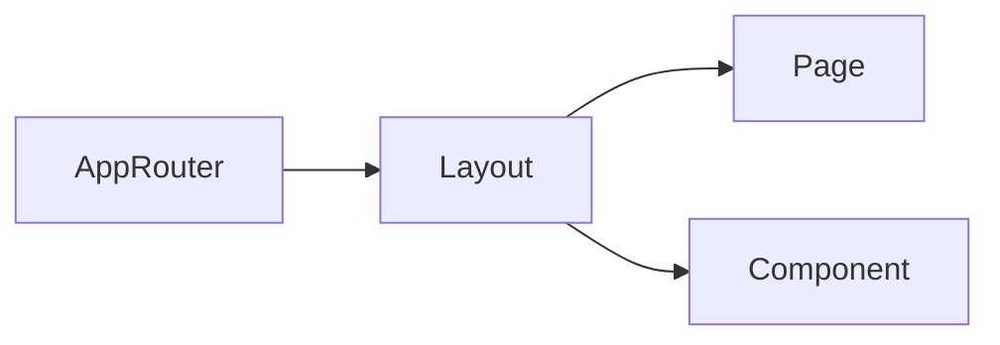

# Terminology

Common project terms and their meaning.

Terms
- App Router - Next.js routing model where pages live in the `app/` directory.
- Root Layout - The shared shell in `app/layout.tsx` that wraps all pages.
- Page - A route entry such as `app/page.tsx`.
- Global Styles - Tailwind base layer and custom CSS in `app/globals.css`.
- Component - Reusable UI module under `app/components/`.

Related
- [Summary](summary.md)
- [Practices](practices.md)
- [Current Plan](plans/current-plan.md)



```ts
export type NavItem = {
  label: string;
  href: string;
};
```

Contracts
- Components under `app/components/` are intended for reuse across pages.
- Layout owns global page chrome (header/footer).
