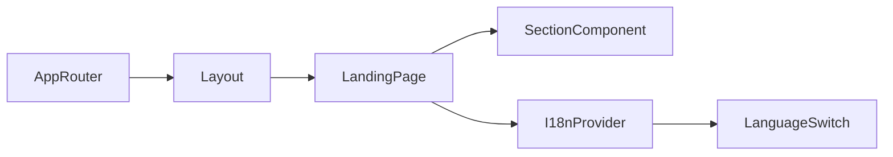

# Terminology

Common project terms and their meaning.

Terms
- App Router - Next.js routing model where routes live in `app/`.
- Root Layout - The shared shell in `app/layout.tsx` that wraps all pages.
- Landing Page - Main route in `app/page.tsx` that composes all homepage sections.
- Global Styles - Tailwind layers and design tokens in `app/globals.css`.
- Section Component - Reusable block in `components/` (for example `hero.tsx`, `services.tsx`).
- I18n Provider - Client context from `lib/i18n.tsx` that stores current locale (`hr` or `en`) and resolves translation keys.
- Language Switch - `components/language-switch.tsx` control that updates locale in I18n context.
- Brand/Ink Palette - Tailwind color scale in `tailwind.config.ts` used across buttons, backgrounds, and text.

Related
- [Summary](summary.md)
- [Practices](practices.md)
- [Current Plan](plans/current-plan.md)
- [Internationalization](i18n/summary.md)



```tsx
const { locale, setLocale, t } = useI18n();

<button onClick={() => setLocale("hr")}>HR</button>
<button onClick={() => setLocale("en")}>EN</button>
<span>{t("nav.about")}</span>
```

Contracts
- Components under `components/` are intended for composition from `app/page.tsx`.
- Layout owns only document shell concerns; page-level chrome is composed in `app/page.tsx`.
