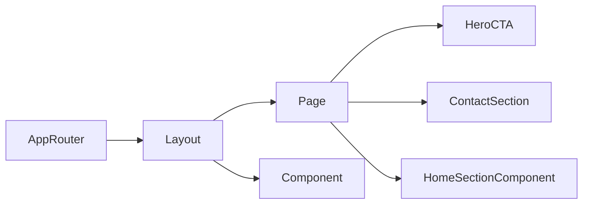

# Terminology

Common project terms and their meaning.

Terms
- App Router - Next.js routing model where pages live in the `app/` directory.
- Root Layout - The shared shell in `app/layout.tsx` that wraps all pages.
- Page - A route entry such as `app/page.tsx`.
- Global Styles - Tailwind base layer and custom CSS in `app/globals.css`.
- Component - Reusable UI module under `app/components/`.
- Hero CTA Anchor - A link in the hero section that scrolls to the `#contact` section.
- Header CTA Button - Shared `CtaButton` rendered on the right side of the header and anchored to `#contact` by default.
- Sticky Header Bar - Top-pinned header (`sticky top-0`) with subtle surface styling for persistent navigation.
- Brand Logo Component - Shared clickable logo + office-name block (`BrandLogo`) linking to `#top` by default.
- Language Provider - Client context that stores current language (`hr`/`en`) and exposes translated copy to components.
- Language Switcher - Header control with two buttons (`HR`, `EN`) using `aria-pressed` to indicate active selection.
- Accent Palette Tokens - CSS variables in `app/globals.css` (`--accent`, `--accent-hover`, `--btn-text`, `--text`, `--background`, `--surface`, `--border`, `--footer-bg`, `--footer-text`, `--footer-link`, `--footer-border`) that drive consistent UI color and contrast behavior.
- Hero Centered Stack - Hero structure that centers title, subtitle, and CTA in a vertical stack across breakpoints.
- Service Card Grid - Responsive six-card services layout (`1` column mobile, `2` tablet, `3` desktop).
- About Signature Block - Name/title sign-off shown beneath About section descriptive paragraphs.
- Map Section - Location block under services with a responsive placeholder for future Google Maps iframe embed.
- Home Section Component - A reusable section module in `app/components/home/` (Hero/About/Services/Map/Contact).
- CTA Button Component - Reusable link button (`CtaButton`) for in-page contact targeting.

Related
- [Summary](summary.md)
- [Practices](practices.md)
- [Current Plan](plans/current-plan.md)
- [Home Main Content](ui/home-main-content.md)



```ts
export type NavItem = {
  label: string;
  href: string;
};
```

Contracts
- Components under `app/components/` are intended for reuse across pages.
- Layout owns global page chrome (header/footer).
- The home page must preserve section IDs used by in-page anchors.
- `CtaButton` defaults to `href="#contact"` and can override label/href/className.
- Selected language persists in `localStorage` key `site_lang`.

Invariants
- Domain copy can be placeholder text, but section structure remains stable: Hero, About Me, Services, Map, Contact.

Rationale
- Shared vocabulary around anchors and service rows reduces ambiguity when iterating on landing page content.

Lessons
- Naming section patterns in the Lode makes future redesign prompts faster to execute.
