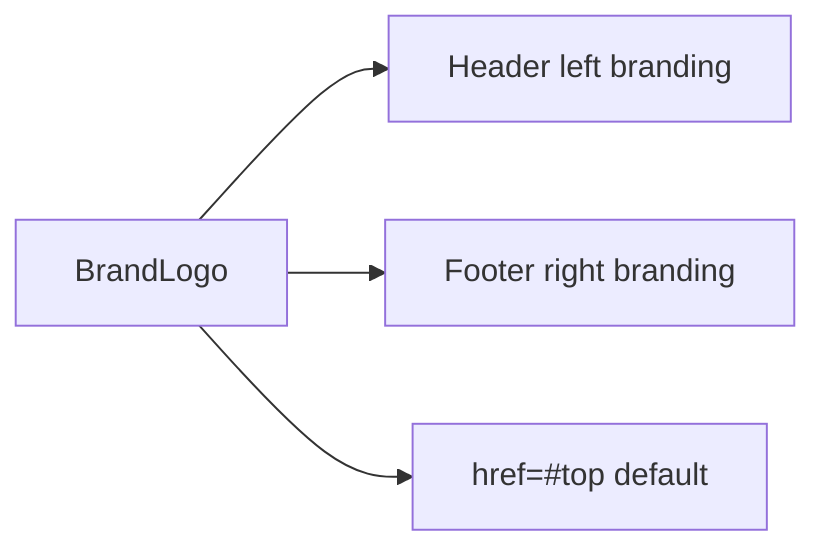

# Brand Logo

`app/components/BrandLogo.tsx` is a shared clickable branding component used by both header and footer, combining a logo placeholder mark and office-name text that links to `#top` by default.

Related
- [Header Layout](header-layout.md)
- [Footer Layout](footer-layout.md)
- [UI Summary](summary.md)



```tsx
type BrandLogoProps = {
  href?: string;
  className?: string;
  size?: "sm" | "md";
};

export default function BrandLogo({ href = "#top", className = "", size = "md" }: BrandLogoProps) {
  return (
    <a href={href} className={className}>
      <span aria-hidden="true" />
      <span>Law Office Name</span>
    </a>
  );
}
```

Invariants
- Component always renders mark + office name as a single clickable unit.
- Default destination is `#top` for scroll-to-top behavior.

Contracts
- `href` allows destination override and defaults to `#top`.
- `className` supports placement/context styling from parent.
- `size` supports compact or default rendering.

Rationale
- A single shared branding component prevents header/footer drift.

Lessons
- Shared primitives are easier to maintain than duplicating logo markup.
