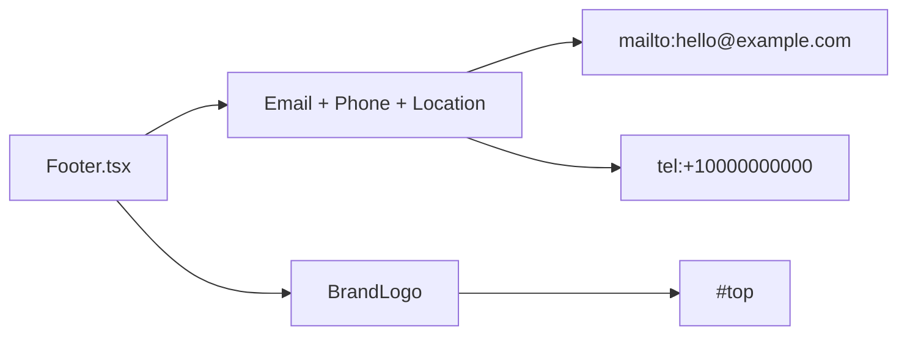

# Footer Layout

`app/components/Footer.tsx` uses a two-side layout: left contact information blocks (`Email`, `Phone`, `Location`) arranged horizontally with wrapping support and right `BrandLogo`, while the outer footer still stacks into a single column on narrow screens.

Related
- [UI Summary](summary.md)
- [Brand Logo](brand-logo.md)
- [Header Layout](header-layout.md)
- [Language Support](language-support.md)



```tsx
<footer>
  <div className="flex flex-col sm:flex-row sm:justify-between">
    <div className="flex flex-wrap items-start gap-x-8 gap-y-4">
      <a href="mailto:hello@example.com">hello@example.com</a>
      <a href="tel:+10000000000">+1 (000) 000-0000</a>
      <p>123 Example Street, City</p>
    </div>
    <BrandLogo size="sm" />
  </div>
</footer>
```

Invariants
- Footer always exposes three contact segments on the left in a horizontal row that can wrap.
- Email and phone remain clickable links.
- Footer brand mark links to `#top`.
- Footer labels update with active language.

Contracts
- Footer must remain responsive: stacked on mobile, split on larger breakpoints.
- Footer continues as layout-owned chrome in `app/layout.tsx`.

Rationale
- Contact details stay scannable while preserving a consistent brand exit point.

Lessons
- Explicit footer information density benefits legal-service trust cues.
