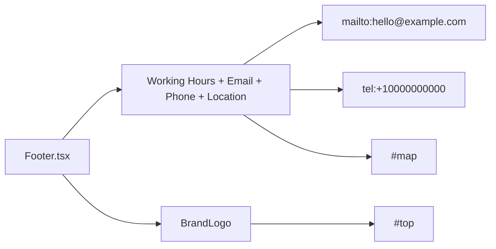

# Footer Layout

`app/components/Footer.tsx` uses a two-side layout with a dark footer surface (`--footer-bg`) and light text tokens; left contact blocks are ordered `Working Hours`, `Email`, `Phone`, `Location`, and use a two-column item pattern (`icon`, `text block`) so icons align with label lines.

Related
- [UI Summary](summary.md)
- [Brand Logo](brand-logo.md)
- [Header Layout](header-layout.md)
- [Language Support](language-support.md)



```tsx
<footer>
  <div className="flex flex-col sm:flex-row sm:justify-between">
    <div className="flex flex-wrap items-start gap-x-8 gap-y-4">
      <div className="grid grid-cols-[1.25rem_auto] items-start gap-x-2">
        <span><svg className="-translate-y-0.5" aria-hidden="true" /></span>
        <span><span>Working Hours</span><span>Mon - Fri: 09:00 - 17:00</span></span>
      </div>
      <a href="mailto:hello@example.com" className="grid grid-cols-[1.25rem_auto] items-start gap-x-2">
        <span><svg aria-hidden="true" /></span>
        <span><span>Email</span><span>hello@example.com</span></span>
      </a>
      <a href="tel:+10000000000" className="grid grid-cols-[1.25rem_auto] items-start gap-x-2">
        <span><svg aria-hidden="true" /></span>
        <span><span>Phone</span><span>+1 (000) 000-0000</span></span>
      </a>
      <a href="#map" className="grid grid-cols-[1.25rem_auto] items-start gap-x-2">
        <span><svg aria-hidden="true" /></span>
        <span><span>Location</span><span>123 Example Street, City</span></span>
      </a>
    </div>
    <BrandLogo size="sm" />
  </div>
</footer>
```

Invariants
- Footer always exposes four contact segments on the left in a horizontal row that can wrap.
- Email and phone remain clickable links.
- Location item links to `#map`.
- Footer brand mark links to `#top`.
- Footer labels update with active language.
- Icons are decorative (`aria-hidden="true"`) and align with label rows through a fixed icon column + text block layout plus a consistent `-translate-y-0.5` icon adjustment.
- Footer text and links use dedicated dark-surface tokens for contrast.

Contracts
- Footer must remain responsive: stacked on mobile, split on larger breakpoints.
- Footer continues as layout-owned chrome in `app/layout.tsx`.

Rationale
- Contact details stay scannable while preserving a consistent brand exit point.

Lessons
- Explicit footer information density benefits legal-service trust cues.
