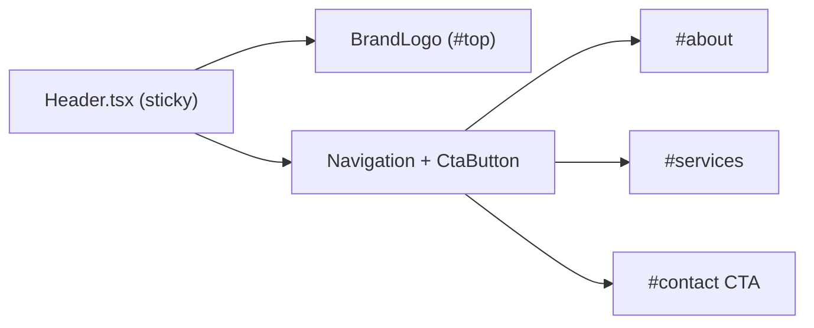

# Header Layout

`app/components/Header.tsx` is a sticky top bar (`sticky top-0`) with a subtle surface (`bg-white/95`, border, shadow) that keeps left `BrandLogo` and right actions (`Navigation` + contact `CtaButton`) visible while scrolling.

Related
- [UI Summary](summary.md)
- [Home Main Content](home-main-content.md)
- [Brand Logo](brand-logo.md)
- [Terminology](../terminology.md)



```tsx
import BrandLogo from "./BrandLogo";
import Navigation from "./Navigation";
import CtaButton from "./home/CtaButton";

const Header = () => (
  <header className="sticky top-0 z-50 border-b border-zinc-200/80 bg-white/95 shadow-sm backdrop-blur">
    <div className="mx-auto flex w-full max-w-6xl items-center justify-between px-4 py-4 sm:px-6">
      <BrandLogo />
      <div className="flex items-center gap-6">
        <Navigation />
        <CtaButton className="px-4 py-2 text-xs sm:text-sm" />
      </div>
    </div>
  </header>
);
```

Invariants
- Header keeps branding on the left and actions on the right.
- Header remains visible during scroll using sticky positioning.
- Header CTA uses the shared `CtaButton` component, not custom anchor markup.
- Primary navigation excludes a plain `Contact` link; contact entry is CTA-only.

Contracts
- CTA defaults to `href="#contact"` unless an explicit override is passed.
- Brand logo defaults to `href="#top"` for scroll-to-top.
- Navigation links target in-page anchors `#about` and `#services`.
- Header container keeps horizontal separation via `justify-between`.

Rationale
- Sticky navigation keeps in-page movement fast on long one-page content.

Lessons
- Reusing one CTA component across header and hero keeps behavior and styling consistent.
