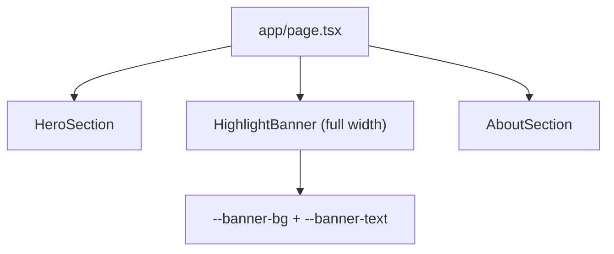

# Highlight Banner

`app/components/home/HighlightBanner.tsx` renders a full-width interstitial section between hero and about, using an accent-tinted background, centered constrained copy width, and fixed Croatian text for a high-visibility legal-business positioning message.

Related
- [UI Summary](summary.md)
- [Home Main Content](home-main-content.md)
- [Header Layout](header-layout.md)



```tsx
<section className="w-full border-y border-[var(--border)] bg-[var(--banner-bg)] py-14 sm:py-16">
  <div className="mx-auto w-full max-w-6xl px-6 sm:px-10 lg:px-16">
    <p className="mx-auto max-w-4xl text-center text-xl leading-relaxed font-semibold text-[var(--banner-text)] sm:text-2xl">
      Poseban naglasak stavljamo na pravnu podršku poduzetnicima, trgovačkim društvima i obrtima u svakodnevnom poslovanju i rješavanju sporova.
    </p>
  </div>
</section>
```

Invariants
- Banner stays between `HeroSection` and `AboutSection` in `app/page.tsx`.
- Banner uses semantic `<section>` markup and centered text alignment across breakpoints.
- Banner copy remains exactly the approved sentence without wording changes.
- Banner remains full-width while text width stays constrained for readability.

Contracts
- Banner is a separate component under `app/components/home/`.
- Banner visual tokens come from `app/globals.css` (`--banner-bg`, `--banner-text`).
- Banner contains no interactive elements and must not create link-like affordances.

Rationale
- A high-contrast interstitial message improves service positioning without changing one-page anchor flow.

Lessons
- Full-width messaging sections are easiest to maintain when page-level containers are split around the interstitial.
