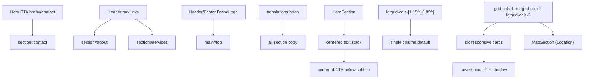

# Home Main Content

`app/page.tsx` composes reusable home-body components from `app/components/home/`: `HeroSection`, `AboutSection`, `ServicesSection`, `MapSection`, and `ContactSection`; each section reads bilingual copy from shared translations while preserving stable anchor IDs.

Related
- [UI Summary](summary.md)
- [Practices](../practices.md)
- [Terminology](../terminology.md)
- [Language Support](language-support.md)



```tsx
<main id="top">
  <HeroSection />
  <AboutSection />
  <ServicesSection />
  <MapSection />
  <ContactSection />
</main>
```

```tsx
<div className="mt-8 grid grid-cols-1 gap-4 md:grid-cols-2 lg:grid-cols-3">
  {services.map((service) => (
    <article key={service.title} className="w-full rounded-xl border border-zinc-200 bg-white p-6">
      <h3>{service.title}</h3>
      <p>{service.description}</p>
    </article>
  ))}
</div>
```

Invariants
- Main content root keeps `id="top"` as return target for brand logo links.
- Section IDs remain constant regardless of active language.
- Hero section always contains a primary CTA that points to `#contact`.
- Hero keeps a centered stack at all breakpoints, with CTA centered below subtitle copy.
- About section is anchor-targetable via `id="about"`.
- About content ends with a signature block (name + title) under the descriptive text.
- Services section is anchor-targetable via `id="services"`.
- Map section is anchor-targetable via `id="map"`.
- Contact section is anchor-targetable via `id="contact"`.
- Services render six cards with `1` column on mobile, `2` on tablet, and `3` on desktop.
- Service cards apply minimal interaction states: `translateY(-2px)` equivalent (`-translate-y-0.5`), subtle shadow increase, and accent border on hover/focus-visible.
- Map section appears between Services and Contact and keeps a responsive embed placeholder.
- Contact form keeps fields: Name, Email, Message, Submit.
- `CtaButton` is reusable and defaults to `href="#contact"` with a default label.
- Service cards keep only container borders; no internal decorative divider bars render above titles.

Contracts
- Page body uses semantic containers (`<main>` and `<section>`).
- About section image placeholder remains aspect-ratio safe.
- Responsive behavior: desktop split for About, stacked mobile flow for all sections.
- `app/page.tsx` contains composition only; section markup lives in route-scoped components.
- Services use `grid-cols-1 md:grid-cols-2 lg:grid-cols-3` for progressive density.
- Anchor targets use `scroll-mt-*` spacing so sticky header does not obscure section headings.
- Palette variables in `app/globals.css` (`--accent`, `--text`, `--background`, `--surface`, `--border`) are consumed via Tailwind arbitrary values.
- Section text is sourced from `app/lib/translations.ts` through `LanguageProvider` context.
- Section headings do not render decorative underline bars or divider rules directly below heading text.

Rationale
- This structure mirrors common legal landing-page expectations while keeping implementation minimal.

Lessons
- A constrained accent palette (`#6c8ca4` + neutrals) keeps legal-service pages distinct without visual noise.
