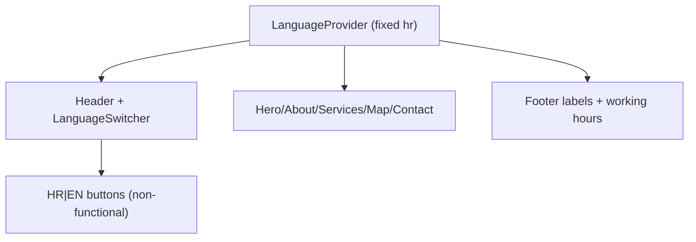

# Language Support

The UI keeps a language-shaped API (`LanguageProvider` + header `HR|EN` controls), but displayed copy is fixed to Croatian (`hr`); language buttons remain visible for layout continuity and do not change content.

Related
- [UI Summary](summary.md)
- [Header Layout](header-layout.md)
- [Home Main Content](home-main-content.md)



```tsx
const language = defaultLanguage;
const noopSetLanguage: LanguageContextValue["setLanguage"] = () => undefined;

const value = {
  language,
  setLanguage: noopSetLanguage,
  t: translations[language],
};
```

Invariants
- Displayed language is always Croatian (`hr`) in current runtime behavior.
- Header retains `HR|EN` buttons for visual consistency, but they are intentionally non-interactive.
- Section anchors (`#about`, `#services`, `#contact`, `#top`) remain stable and independent of language controls.

Contracts
- `translations` object in `app/lib/translations.ts` is the source of all displayed copy.
- `LanguageProvider` exposes `language`, `setLanguage`, and `t`, but `setLanguage` is a no-op.
- Header language controls use button semantics with `aria-pressed` and `aria-disabled`.
- Language switcher is rendered on the right side of header actions.

Rationale
- Keeping a stable language API avoids refactoring section components while translation toggling is intentionally disabled.

Lessons
- A no-op switcher preserves the expected header layout while removing accidental language state drift.
