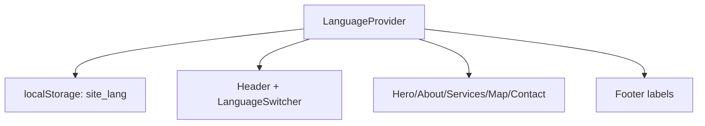

# Language Support

The UI uses client-side bilingual support (`hr` + `en`) powered by `LanguageProvider`, where selected language is persisted in `localStorage` under `site_lang` and defaults to Croatian when missing.

Related
- [UI Summary](summary.md)
- [Header Layout](header-layout.md)
- [Home Main Content](home-main-content.md)



```tsx
const [language, setLanguage] = useState<Language>("hr");

useEffect(() => {
  const stored = window.localStorage.getItem("site_lang");
  if (stored === "hr" || stored === "en") {
    setLanguage(stored);
  }
}, []);
```

Invariants
- Supported languages are exactly `hr` and `en`.
- Default language is Croatian (`hr`) when no persisted selection exists.
- Section anchors (`#about`, `#services`, `#contact`, `#top`) remain stable across language switches.

Contracts
- `translations` object in `app/lib/translations.ts` is the source of all displayed copy.
- Header language controls use button semantics with `aria-pressed` on the active language.
- Language switcher is rendered on the right side of header actions.

Rationale
- Lightweight in-app translations avoid adding heavy i18n dependencies for a single-page brochure site.

Lessons
- Centralized translation keys make UI text changes safer than inline strings in each section.
