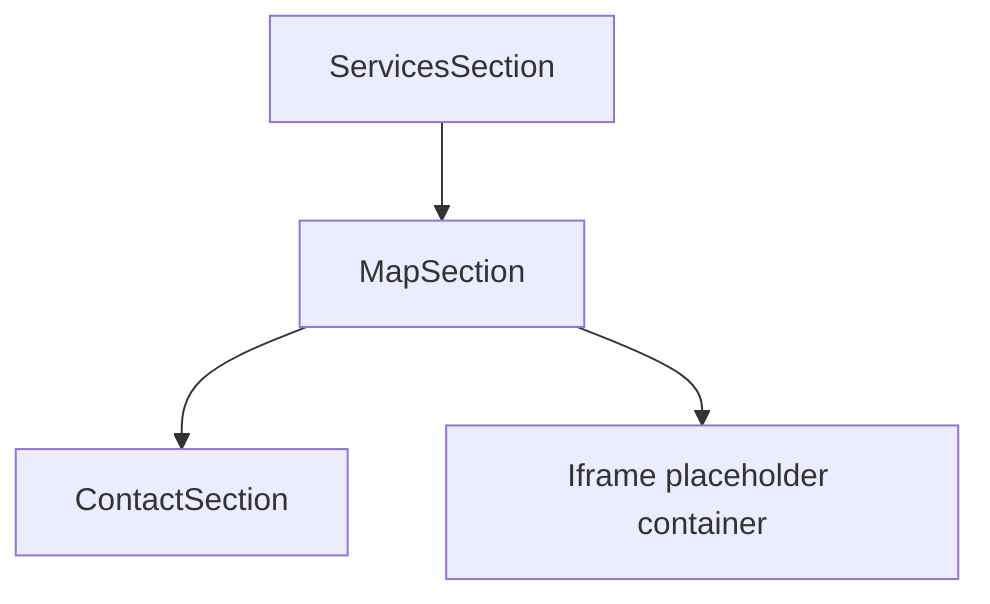

# Map Section

`app/components/home/MapSection.tsx` is a dedicated location block placed directly after `ServicesSection` and before `ContactSection`, containing a heading and a responsive map-embed placeholder container.

Related
- [Home Main Content](home-main-content.md)
- [UI Summary](summary.md)
- [Practices](../practices.md)



```tsx
<section aria-labelledby="location-heading">
  <h2 id="location-heading">Location</h2>
  <div className="overflow-hidden rounded-xl border">
    <div className="aspect-video w-full">
      <div>Paste Google Maps iframe here.</div>
    </div>
  </div>
</section>
```

Invariants
- Map section appears directly under services in the page flow.
- Placeholder container maintains responsive bounds without overflow.

Contracts
- Section heading remains `Location` to match legal-office discoverability expectations.
- Embed slot can be replaced by a future `<iframe>` without structural changes.

Rationale
- A dedicated map section keeps location context visible before contact conversion.

Lessons
- Designing a stable embed slot early avoids later layout rework.
