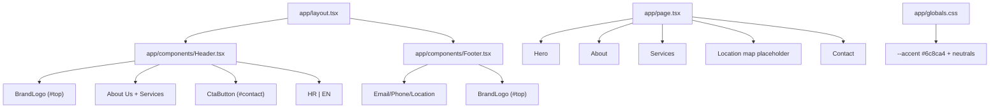

# UI Summary

The UI layer currently uses a shared `app/layout.tsx` shell (header/footer) with route-specific body content in `app/page.tsx`; a client `LanguageProvider` exposes fixed Croatian (`hr`) copy, the sticky header includes a right-side `HR|EN` button pair rendered as non-functional controls, all home/footer text reads from centralized translation keys, and anchor navigation remains stable.

Related
- [Lode Map](../lode-map.md)
- [Summary](../summary.md)
- [Home Main Content](home-main-content.md)
- [Header Layout](header-layout.md)
- [Footer Layout](footer-layout.md)
- [Brand Logo](brand-logo.md)
- [Map Section](map-section.md)
- [Language Support](language-support.md)



```tsx
<main id="top">
  <HeroSection />
  <AboutSection />
  <ServicesSection />
  <MapSection />
  <ContactSection />
</main>
```

Invariants
- Shared layout chrome remains outside page-body implementation tasks.
- Section order on home page is Hero -> About Me -> Services -> Location Map -> Contact.
- Header keeps branding on the left and actions on the right.
- Header remains sticky at top with persistent visibility.
- Hero uses a centered stack at all breakpoints, with CTA centered beneath title/subtitle copy.
- Services show six cards using `grid-cols-1 md:grid-cols-2 lg:grid-cols-3`.
- Interactive states (hover/focus) use accent color tokens and shared button styles (`.btn-primary`) for contrast-safe CTA rendering.
- UI copy is sourced from translations but rendered in fixed Croatian (`hr`).
- Service cards include minimal hover/focus lift animations for discoverability.

Contracts
- Contact section exposes `id="contact"` for in-page navigation.
- About and services sections expose `id="about"` and `id="services"` for header navigation.
- Main content exposes `id="top"` for logo scroll-to-top behavior.
- About section uses desktop side-by-side layout and mobile stacking.
- `HeroSection` uses `CtaButton` rather than inline anchor CTA markup.
- Header CTA uses the shared `CtaButton` component and keeps contact anchor behavior without a duplicate plain Contact nav link.
- `app/globals.css` is the source of palette/button tokens (`--accent`, `--accent-hover`, `--btn-text`, `--text`, `--background`, `--surface`, `--border`) and shared button utility styles.
- Footer-specific contrast tokens (`--footer-bg`, `--footer-text`, `--footer-link`, `--footer-border`) drive dark footer readability.
- Language controls are presentational only and do not persist or mutate language state.

Rationale
- Keeping the home page as a clean one-page flow reduces cognitive load for first-time legal-service visitors.

Lessons
- Explicit section boundaries in markup make future visual redesigns lower-risk.
